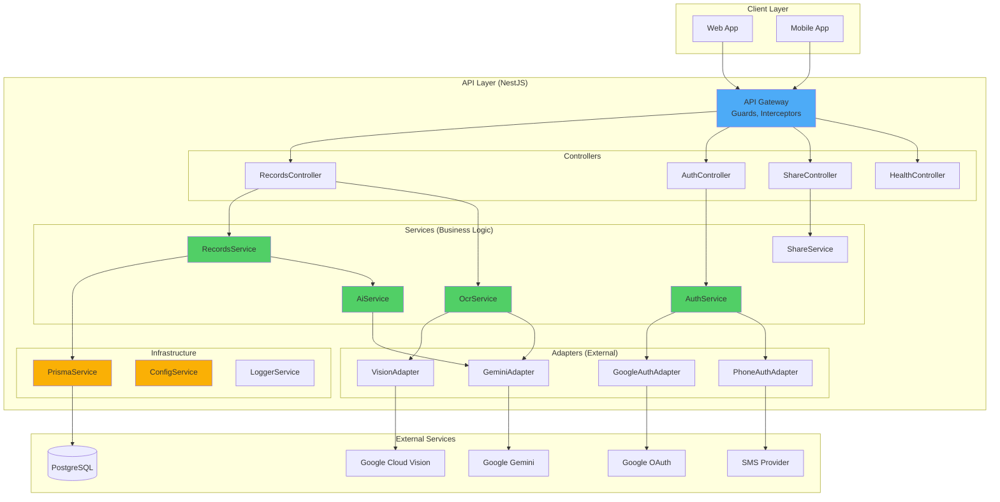
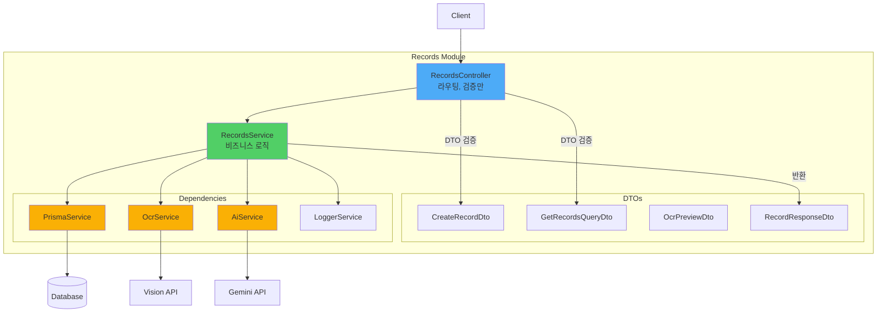
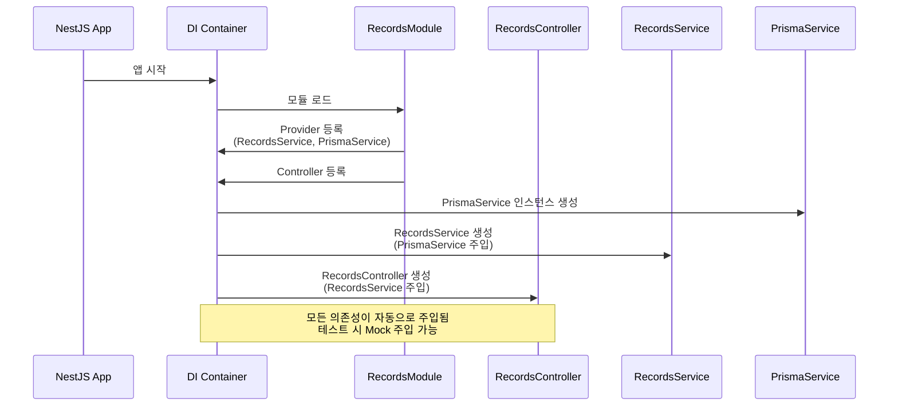
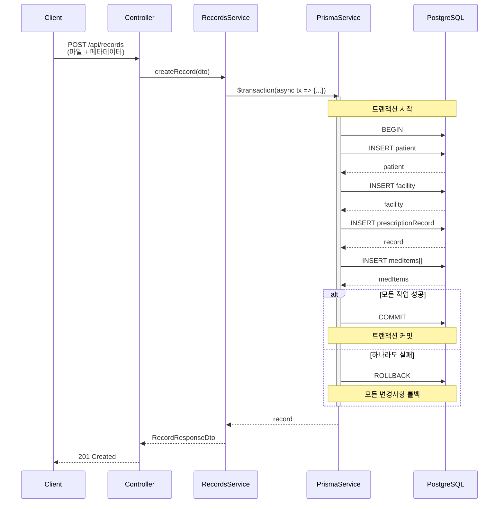

# Backend Architecture Refactoring Guide

> **작성일**: 2026-01-01
> **작성자**: Senior NestJS Architect
> **목적**: MedBridge 백엔드를 NestJS Best Practice에 맞게 리팩토링

## 📋 목차

1. [현재 문제점 분석](#현재-문제점-분석)
2. [개선 아키텍처 설계](#개선-아키텍처-설계)
3. [상세 구조 다이어그램](#상세-구조-다이어그램)
4. [리팩토링 로드맵](#리팩토링-로드맵)
5. [기대 효과](#기대-효과)

---

## 현재 문제점 분석

### 🔴 Critical Issues

#### 1. Service Layer 부재
- **문제**: 모든 비즈니스 로직이 Controller에 존재 (RecordsController: 1,040줄)
- **영향**:
  - 단일 책임 원칙(SRP) 위반
  - 테스트 불가능
  - 코드 재사용 불가능
  - 유지보수 어려움

```typescript
// ❌ 현재: Controller가 모든 것을 담당
@Controller()
export class RecordsController {
  @Post('/api/records/preview-ocr')
  async previewOcr(@UploadedFile() file) {
    // 1. 파일 검증 로직
    if (!file?.buffer) throw new BadRequestException('file_required');

    // 2. OCR 처리 로직 (50줄+)
    const geminiEnabled = isGeminiOcrEnabled();
    if (geminiEnabled) {
      const r = await extractMedicationsFromImage(...);
      // ...
    }

    // 3. Vision API 호출 로직 (30줄+)
    const visionResult = await ocrTextFromImageBytes(buf);

    // 4. 데이터 변환 로직 (20줄+)
    const meds = medicationsDetailed ? ... : parseMedCandidates(text);

    // 5. 응답 생성 로직
    return { rawText, medications, ... };
  }
}
```

#### 2. 의존성 주입(DI) 미사용
- **문제**: 모든 의존성을 직접 import
- **영향**:
  - Mock 불가능 → 단위 테스트 불가능
  - 의존성 교체 어려움
  - NestJS의 핵심 기능 미활용

```typescript
// ❌ 현재: 직접 import (하드코딩)
import { prisma } from '@medilink/db';
import { ocrTextFromImageBytes } from '../lib/vision';
import { extractMedicationsFromImage } from '../lib/genaiOcr';

// Mock/교체 불가능!
const result = await ocrTextFromImageBytes(buffer);
const medications = await extractMedicationsFromImage(buffer, mimeType);
```

#### 3. 모듈화 부재
- **문제**: AppModule에 모든 Controller만 나열, Provider는 비어있음
- **영향**:
  - 기능별 분리 불가능
  - 의존성 관리 어려움
  - 확장성 부족

```typescript
// ❌ 현재: Flat한 구조
@Module({
  imports: [],
  controllers: [
    HealthController,
    AuthController,
    RecordsController,
    ShareController,
  ],
  providers: [],  // 비어있음!
})
export class AppModule {}
```

### 🟡 High Priority Issues

#### 4. DTO/Validation 패턴 불일치
- **문제**: Zod를 Controller에서 직접 사용
- **영향**:
  - NestJS의 ValidationPipe 미활용
  - 중복 코드 발생
  - 타입 안정성 부족

```typescript
// ❌ 현재: Zod로 수동 검증
const parsed = z.object({
  patientId: z.string().uuid(),
  days: z.coerce.number().int().positive().max(3650).optional(),
}).safeParse(query);

if (!parsed.success) {
  throw new BadRequestException({
    error: 'invalid_query',
    details: parsed.error.flatten(),
  });
}
```

#### 5. 트랜잭션 관리 부재
- **문제**: 여러 DB 작업이 트랜잭션 없이 실행
- **영향**:
  - 데이터 일관성 문제
  - 부분 실패 시 복구 불가능

```typescript
// ❌ 현재: 트랜잭션 없음
const patient = await prisma.patient.upsert({...});  // 성공
const facility = await prisma.facility.create({...}); // 실패 → patient만 생성됨!
const record = await prisma.prescriptionRecord.create({...});
```

#### 6. 예외 처리 불일치
- **문제**: 에러 형식이 일관되지 않음
- **영향**:
  - 클라이언트가 에러 파싱 어려움
  - 로깅/모니터링 어려움

```typescript
// ❌ 현재: 일관성 없는 에러 처리
throw new BadRequestException('file_required');  // 문자열
throw new ServiceUnavailableException({          // 객체
  error: 'ocr_unavailable',
  hint: '...',
});
```

### 🟢 Medium Priority Issues

7. **설정 관리**: process.env 직접 접근
8. **로깅**: console.log와 Logger 혼용
9. **코드 중복**: 유사한 로직 반복
10. **테스트**: 테스트 코드 부재

---

## 개선 아키텍처 설계

### 🎯 핵심 원칙

1. **계층 분리 (Layered Architecture)**
   - Controller: 요청/응답 처리, 검증
   - Service: 비즈니스 로직
   - Repository/Adapter: 데이터 접근, 외부 API

2. **의존성 주입 (Dependency Injection)**
   - 모든 의존성을 DI 컨테이너로 관리
   - 인터페이스 기반 설계

3. **모듈화 (Feature Modules)**
   - 기능별 모듈 분리
   - 명확한 의존성 관계

4. **SOLID 원칙**
   - Single Responsibility
   - Open/Closed
   - Liskov Substitution
   - Interface Segregation
   - Dependency Inversion

---

## 상세 구조 다이어그램

### 1. 전체 아키텍처 (High-Level)



### 2. Records 모듈 상세 구조



### 3. OCR Service 구조 (Strategy Pattern)

```mermaid
graph TB
    subgraph "OCR Module"
        OcrSvc[OcrService<br/>비즈니스 로직]

        subgraph "Strategy Interface"
            IOcrAdapter[IOcrAdapter<br/>Interface]
        end

        subgraph "Concrete Strategies"
            VisionAdapter[VisionAdapter<br/>Google Cloud Vision]
            GeminiAdapter[GeminiOcrAdapter<br/>Gemini Multimodal]
            MockAdapter[MockOcrAdapter<br/>개발용]
        end

        Factory[OcrAdapterFactory<br/>Config 기반 선택]
    end

    RecordsSvc[RecordsService] --> OcrSvc
    OcrSvc --> IOcrAdapter
    IOcrAdapter <|.. VisionAdapter
    IOcrAdapter <|.. GeminiAdapter
    IOcrAdapter <|.. MockAdapter

    Factory --> |GEMINI_OCR_ENABLED=true| GeminiAdapter
    Factory --> |GEMINI_OCR_ENABLED=false| VisionAdapter
    Factory --> |NODE_ENV=dev| MockAdapter

    OcrSvc --> Factory

    VisionAdapter --> VisionAPI[Google Cloud Vision]
    GeminiAdapter --> GeminiAPI[Google Gemini]

    style OcrSvc fill:#51cf66
    style IOcrAdapter fill:#fab005
    style Factory fill:#fab005
```

### 4. 의존성 주입 흐름



### 5. 트랜잭션 처리 흐름



### 6. Exception Filter 흐름

```mermaid
graph TB
    subgraph "Request Flow"
        Client[Client Request]
        Guard[Auth Guard]
        Pipe[ValidationPipe]
        Ctrl[Controller]
        Svc[Service]
    end

    subgraph "Exception Handling"
        Filter[AllExceptionsFilter]
        Logger[LoggerService]
        Response[Error Response]
    end

    Client --> Guard
    Guard --> |인증 실패| Filter
    Guard --> |성공| Pipe
    Pipe --> |검증 실패| Filter
    Pipe --> |성공| Ctrl
    Ctrl --> Svc
    Svc --> |예외 발생| Filter

    Filter --> Logger
    Filter --> Response
    Response --> Client

    style Filter fill:#ff6b6b
    style Logger fill:#fab005
```



---

## 리팩토링 로드맵

### Phase 1: 핵심 인프라 구축 (1-2주)

#### 1.1 PrismaService 생성
**목표**: Prisma를 DI 컨테이너에 등록하여 주입 가능하게

```typescript
// ✅ src/database/prisma.service.ts
import { Injectable, OnModuleInit, OnModuleDestroy } from '@nestjs/common';
import { PrismaClient } from '@medilink/db';

@Injectable()
export class PrismaService extends PrismaClient implements OnModuleInit, OnModuleDestroy {
  async onModuleInit() {
    await this.$connect();
  }

  async onModuleDestroy() {
    await this.$disconnect();
  }
}
```

```typescript
// ✅ src/database/database.module.ts
import { Module, Global } from '@nestjs/common';
import { PrismaService } from './prisma.service';

@Global()
@Module({
  providers: [PrismaService],
  exports: [PrismaService],
})
export class DatabaseModule {}
```

**커밋 메시지**: `feat(database): add PrismaService with DI support`

---

#### 1.2 ConfigModule 도입
**목표**: 환경 변수를 타입 안전하게 관리

```typescript
// ✅ src/config/configuration.ts
export default () => ({
  port: parseInt(process.env.PORT, 10) || 8787,
  host: process.env.HOST || '0.0.0.0',
  database: {
    url: process.env.DATABASE_URL,
  },
  session: {
    secret: process.env.SESSION_SECRET || 'dev-only-secret',
  },
  ocr: {
    geminiEnabled: process.env.GEMINI_OCR_ENABLED === 'true',
    visionEnabled: process.env.GOOGLE_CLOUD_VISION_ENABLED === 'true',
  },
  auth: {
    enabled: process.env.AUTH_ENABLED !== 'false',
    google: {
      clientId: process.env.GOOGLE_OAUTH_CLIENT_ID,
      clientSecret: process.env.GOOGLE_OAUTH_CLIENT_SECRET,
    },
  },
});
```

```typescript
// ✅ app.module.ts 수정
@Module({
  imports: [
    ConfigModule.forRoot({
      isGlobal: true,
      load: [configuration],
    }),
    DatabaseModule,
    // ...
  ],
})
export class AppModule {}
```

**커밋 메시지**: `feat(config): add ConfigModule for type-safe environment variables`

---

#### 1.3 Logger 통일
**목표**: console.log를 NestJS Logger로 통일

```typescript
// ✅ src/common/logger/logger.service.ts
import { Injectable, LoggerService as NestLoggerService } from '@nestjs/common';

@Injectable()
export class LoggerService implements NestLoggerService {
  log(message: string, context?: string) {
    // 프로덕션에서는 외부 로깅 서비스 연동 가능
    console.log(`[${context || 'App'}] ${message}`);
  }

  error(message: string, trace?: string, context?: string) {
    console.error(`[${context || 'App'}] ${message}`, trace);
  }

  warn(message: string, context?: string) {
    console.warn(`[${context || 'App'}] ${message}`);
  }

  debug(message: string, context?: string) {
    console.debug(`[${context || 'App'}] ${message}`);
  }

  verbose(message: string, context?: string) {
    console.log(`[${context || 'App'}] ${message}`);
  }
}
```

**커밋 메시지**: `feat(common): add unified LoggerService`

---

#### 1.4 Global Exception Filter
**목표**: 일관된 에러 응답 형식

```typescript
// ✅ src/common/filters/all-exceptions.filter.ts
import {
  ExceptionFilter,
  Catch,
  ArgumentsHost,
  HttpException,
  HttpStatus,
  Injectable,
} from '@nestjs/common';
import { Response } from 'express';
import { LoggerService } from '../logger/logger.service';

@Catch()
@Injectable()
export class AllExceptionsFilter implements ExceptionFilter {
  constructor(private readonly logger: LoggerService) {}

  catch(exception: unknown, host: ArgumentsHost) {
    const ctx = host.switchToHttp();
    const response = ctx.getResponse<Response>();
    const request = ctx.getRequest();

    const status =
      exception instanceof HttpException
        ? exception.getStatus()
        : HttpStatus.INTERNAL_SERVER_ERROR;

    const message =
      exception instanceof HttpException
        ? exception.getResponse()
        : 'Internal server error';

    this.logger.error(
      `${request.method} ${request.url} - ${status}`,
      exception instanceof Error ? exception.stack : String(exception),
      'AllExceptionsFilter',
    );

    response.status(status).json({
      statusCode: status,
      timestamp: new Date().toISOString(),
      path: request.url,
      ...(typeof message === 'string' ? { message } : message),
    });
  }
}
```

```typescript
// ✅ main.ts 수정
app.useGlobalFilters(new AllExceptionsFilter(app.get(LoggerService)));
```

**커밋 메시지**: `feat(common): add global exception filter for consistent error handling`

---

### Phase 2: Service Layer 분리 (2-3주)

#### 2.1 RecordsService 생성
**목표**: RecordsController에서 비즈니스 로직 추출

**파일 구조**:
```
src/modules/records/
├── records.module.ts
├── records.controller.ts (간소화)
├── records.service.ts (신규)
├── dto/
│   ├── create-record.dto.ts
│   ├── get-records-query.dto.ts
│   ├── ocr-preview.dto.ts
│   └── record-response.dto.ts
└── entities/
    └── record.entity.ts
```

```typescript
// ✅ src/modules/records/records.service.ts
import { Injectable, BadRequestException } from '@nestjs/common';
import { PrismaService } from '../../database/prisma.service';
import { LoggerService } from '../../common/logger/logger.service';
import { CreateRecordDto } from './dto/create-record.dto';
import { RecordEntity } from './entities/record.entity';

@Injectable()
export class RecordsService {
  constructor(
    private readonly prisma: PrismaService,
    private readonly logger: LoggerService,
  ) {}

  async createRecord(dto: CreateRecordDto): Promise<RecordEntity> {
    this.logger.log('Creating record', 'RecordsService');

    return this.prisma.$transaction(async (tx) => {
      // 트랜잭션 내에서 모든 DB 작업 수행
      const patient = await tx.patient.upsert({
        where: { id: dto.patientId },
        update: {},
        create: { id: dto.patientId },
      });

      let facilityId: string | null = null;
      if (dto.facilityName) {
        const facility = await tx.facility.create({
          data: {
            name: dto.facilityName,
            type: dto.facilityType ?? 'unknown',
          },
        });
        facilityId = facility.id;
      }

      const record = await tx.prescriptionRecord.create({
        data: {
          patientId: patient.id,
          facilityId,
          recordType: dto.recordType,
          chiefComplaint: dto.chiefComplaint,
          // ... 나머지 필드
          medItems: {
            create: dto.medications.map((m) => ({
              nameRaw: m.name,
              dose: m.dosage,
              frequency: m.frequency,
              confidence: m.confidence,
            })),
          },
        },
        include: {
          medItems: true,
          facility: true,
        },
      });

      return record as RecordEntity;
    });
  }

  async getRecords(patientId: string): Promise<RecordEntity[]> {
    this.logger.log(`Getting records for patient ${patientId}`, 'RecordsService');

    const records = await this.prisma.prescriptionRecord.findMany({
      where: { patientId },
      include: {
        medItems: true,
        facility: true,
        ocrExtraction: true,
      },
      orderBy: { createdAt: 'desc' },
    });

    return records as RecordEntity[];
  }

  async countRecords(patientId: string, days: number = 90): Promise<number> {
    const since = new Date(Date.now() - days * 24 * 60 * 60 * 1000);

    return this.prisma.prescriptionRecord.count({
      where: {
        patientId,
        createdAt: { gte: since },
      },
    });
  }
}
```

```typescript
// ✅ src/modules/records/records.controller.ts (간소화)
import { Controller, Get, Post, Body, Query, UseGuards } from '@nestjs/common';
import { RecordsService } from './records.service';
import { CreateRecordDto } from './dto/create-record.dto';
import { GetRecordsQueryDto } from './dto/get-records-query.dto';

@Controller('records')
export class RecordsController {
  constructor(private readonly recordsService: RecordsService) {}

  @Get()
  async getRecords(@Query() query: GetRecordsQueryDto) {
    return this.recordsService.getRecords(query.patientId);
  }

  @Get('count')
  async count(@Query() query: GetRecordsQueryDto) {
    const count = await this.recordsService.countRecords(
      query.patientId,
      query.days,
    );
    return { count };
  }

  @Post()
  async createRecord(@Body() dto: CreateRecordDto) {
    return this.recordsService.createRecord(dto);
  }
}
```

**커밋 메시지**: `refactor(records): extract business logic to RecordsService with transaction support`

---

#### 2.2 OcrService 생성 (Strategy Pattern)
**목표**: OCR 로직을 추상화하고 다양한 Provider 지원

```typescript
// ✅ src/modules/ocr/interfaces/ocr-adapter.interface.ts
export interface IOcrAdapter {
  extractText(buffer: Buffer, mimeType: string): Promise<OcrTextResult>;
  extractMedications(buffer: Buffer, mimeType: string): Promise<OcrMedicationResult>;
}

export interface OcrTextResult {
  rawText: string;
  confidence?: number;
  textAnnotations?: TextAnnotation[];
}

export interface OcrMedicationResult {
  medications: MedicationDetail[];
  hospitalName?: string;
  patientCondition?: string;
}
```

```typescript
// ✅ src/modules/ocr/adapters/gemini-ocr.adapter.ts
import { Injectable } from '@nestjs/common';
import { ConfigService } from '@nestjs/config';
import { IOcrAdapter, OcrTextResult, OcrMedicationResult } from '../interfaces/ocr-adapter.interface';
import { extractMedicationsFromImage } from '../../../lib/genaiOcr';

@Injectable()
export class GeminiOcrAdapter implements IOcrAdapter {
  constructor(private readonly config: ConfigService) {}

  async extractText(buffer: Buffer, mimeType: string): Promise<OcrTextResult> {
    const result = await extractMedicationsFromImage(buffer, mimeType);
    return {
      rawText: result.rawText ?? '',
      textAnnotations: [],
    };
  }

  async extractMedications(buffer: Buffer, mimeType: string): Promise<OcrMedicationResult> {
    return extractMedicationsFromImage(buffer, mimeType);
  }
}
```

```typescript
// ✅ src/modules/ocr/ocr.service.ts
import { Injectable, Inject } from '@nestjs/common';
import { IOcrAdapter } from './interfaces/ocr-adapter.interface';
import { LoggerService } from '../../common/logger/logger.service';

@Injectable()
export class OcrService {
  constructor(
    @Inject('OCR_ADAPTER') private readonly adapter: IOcrAdapter,
    private readonly logger: LoggerService,
  ) {}

  async analyzeImage(buffer: Buffer, mimeType: string) {
    this.logger.log('Analyzing image with OCR', 'OcrService');

    const [textResult, medicationResult] = await Promise.all([
      this.adapter.extractText(buffer, mimeType),
      this.adapter.extractMedications(buffer, mimeType),
    ]);

    return {
      rawText: textResult.rawText,
      textAnnotations: textResult.textAnnotations,
      medications: medicationResult.medications,
      hospitalName: medicationResult.hospitalName,
      patientCondition: medicationResult.patientCondition,
    };
  }
}
```

```typescript
// ✅ src/modules/ocr/ocr.module.ts
import { Module } from '@nestjs/common';
import { ConfigService } from '@nestjs/config';
import { OcrService } from './ocr.service';
import { GeminiOcrAdapter } from './adapters/gemini-ocr.adapter';
import { VisionOcrAdapter } from './adapters/vision-ocr.adapter';
import { MockOcrAdapter } from './adapters/mock-ocr.adapter';

@Module({
  providers: [
    OcrService,
    {
      provide: 'OCR_ADAPTER',
      useFactory: (config: ConfigService) => {
        const geminiEnabled = config.get<boolean>('ocr.geminiEnabled');
        const visionEnabled = config.get<boolean>('ocr.visionEnabled');

        if (geminiEnabled) {
          return new GeminiOcrAdapter(config);
        } else if (visionEnabled) {
          return new VisionOcrAdapter(config);
        } else {
          return new MockOcrAdapter();
        }
      },
      inject: [ConfigService],
    },
  ],
  exports: [OcrService],
})
export class OcrModule {}
```

**커밋 메시지**: `feat(ocr): implement OcrService with Strategy pattern for multiple OCR providers`

---

#### 2.3 AiService 생성
**목표**: AI 분석 로직 분리

```typescript
// ✅ src/modules/ai/ai.service.ts
import { Injectable } from '@nestjs/common';
import { LoggerService } from '../../common/logger/logger.service';
import { analyzePatientStatus } from '../../lib/gemini';

@Injectable()
export class AiService {
  constructor(private readonly logger: LoggerService) {}

  async analyzePatientStatus(data: PatientStatusInput): Promise<string | null> {
    this.logger.log('Analyzing patient status with AI', 'AiService');

    try {
      return await analyzePatientStatus(data);
    } catch (error) {
      this.logger.error(
        'AI analysis failed',
        error instanceof Error ? error.stack : String(error),
        'AiService',
      );
      return null;
    }
  }
}
```

**커밋 메시지**: `feat(ai): add AiService for patient status analysis`

---

#### 2.4 AuthService 생성
**목표**: 인증 로직 분리

```typescript
// ✅ src/modules/auth/auth.service.ts
import { Injectable, UnauthorizedException } from '@nestjs/common';
import { ConfigService } from '@nestjs/config';
import { LoggerService } from '../../common/logger/logger.service';

@Injectable()
export class AuthService {
  constructor(
    private readonly config: ConfigService,
    private readonly logger: LoggerService,
  ) {}

  async verifyGoogleToken(idToken: string): Promise<GoogleUser> {
    this.logger.log('Verifying Google ID token', 'AuthService');

    try {
      const client = getGoogleClient();
      const ticket = await client.verifyIdToken({
        idToken,
        audience: this.config.get('auth.google.clientId'),
      });

      const payload = ticket.getPayload();
      if (!payload?.sub) {
        throw new UnauthorizedException('invalid_token');
      }

      return {
        id: crypto.randomUUID(),
        provider: 'google',
        subject: payload.sub,
        displayName: payload.name ?? payload.email ?? undefined,
      };
    } catch (error) {
      this.logger.error(
        'Google token verification failed',
        error instanceof Error ? error.stack : String(error),
        'AuthService',
      );
      throw new UnauthorizedException('google_verify_failed');
    }
  }

  async sendPhoneOtp(phoneE164: string): Promise<{ challengeId: string; expiresAt: number }> {
    this.logger.log(`Sending OTP to ${phoneE164}`, 'AuthService');
    // ... OTP 전송 로직
  }

  async verifyPhoneOtp(challengeId: string, code: string): Promise<PhoneUser> {
    this.logger.log('Verifying phone OTP', 'AuthService');
    // ... OTP 검증 로직
  }
}
```

**커밋 메시지**: `refactor(auth): extract authentication logic to AuthService`

---

### Phase 3: 고도화 (2-3주)

#### 3.1 DTO 클래스 전환
**목표**: Zod → class-validator로 전환

```typescript
// ✅ src/modules/records/dto/create-record.dto.ts
import { IsUUID, IsEnum, IsString, IsOptional, IsArray, ValidateNested, IsNumber } from 'class-validator';
import { Type } from 'class-transformer';

export class MedicationDto {
  @IsString()
  name: string;

  @IsOptional()
  @IsString()
  dosage?: string;

  @IsOptional()
  @IsString()
  frequency?: string;

  @IsOptional()
  @IsNumber()
  confidence?: number;
}

export class CreateRecordDto {
  @IsUUID()
  patientId: string;

  @IsEnum(['dispensing_record', 'prescription'])
  recordType: 'dispensing_record' | 'prescription';

  @IsOptional()
  @IsString()
  facilityName?: string;

  @IsOptional()
  @IsString()
  chiefComplaint?: string;

  @IsArray()
  @ValidateNested({ each: true })
  @Type(() => MedicationDto)
  medications: MedicationDto[];
}
```

```typescript
// ✅ main.ts - Global ValidationPipe 설정
app.useGlobalPipes(
  new ValidationPipe({
    whitelist: true,
    forbidNonWhitelisted: true,
    transform: true,
    transformOptions: {
      enableImplicitConversion: true,
    },
  }),
);
```

**커밋 메시지**: `refactor(dto): migrate from Zod to class-validator for DTOs`

---

#### 3.2 Guards 추가
**목표**: 인증 체크를 Guard로 분리

```typescript
// ✅ src/common/guards/auth.guard.ts
import { Injectable, CanActivate, ExecutionContext, UnauthorizedException } from '@nestjs/common';
import { ConfigService } from '@nestjs/config';
import { Request } from 'express';

@Injectable()
export class AuthGuard implements CanActivate {
  constructor(private readonly config: ConfigService) {}

  canActivate(context: ExecutionContext): boolean {
    const authEnabled = this.config.get<boolean>('auth.enabled');

    if (!authEnabled) {
      return true; // 인증 비활성화 시 통과
    }

    const request = context.switchToHttp().getRequest<Request>();

    if (!request.session?.user) {
      throw new UnauthorizedException('unauthorized');
    }

    return true;
  }
}
```

```typescript
// ✅ Controller에서 사용
@Controller('records')
@UseGuards(AuthGuard)
export class RecordsController {
  // 모든 라우트에 인증 적용
}
```

**커밋 메시지**: `feat(common): add AuthGuard for declarative authentication`

---

#### 3.3 Interceptors 추가
**목표**: 로깅, 변환 등을 Interceptor로 처리

```typescript
// ✅ src/common/interceptors/logging.interceptor.ts
import { Injectable, NestInterceptor, ExecutionContext, CallHandler } from '@nestjs/common';
import { Observable } from 'rxjs';
import { tap } from 'rxjs/operators';
import { LoggerService } from '../logger/logger.service';

@Injectable()
export class LoggingInterceptor implements NestInterceptor {
  constructor(private readonly logger: LoggerService) {}

  intercept(context: ExecutionContext, next: CallHandler): Observable<any> {
    const request = context.switchToHttp().getRequest();
    const { method, url } = request;
    const now = Date.now();

    return next.handle().pipe(
      tap(() => {
        const responseTime = Date.now() - now;
        this.logger.log(
          `${method} ${url} - ${responseTime}ms`,
          'LoggingInterceptor',
        );
      }),
    );
  }
}
```

**커밋 메시지**: `feat(common): add LoggingInterceptor for request/response logging`

---

#### 3.4 모듈 최종 분리
**목표**: Feature Module 완성

```
src/
├── main.ts
├── app.module.ts
├── common/
│   ├── filters/
│   │   └── all-exceptions.filter.ts
│   ├── guards/
│   │   └── auth.guard.ts
│   ├── interceptors/
│   │   └── logging.interceptor.ts
│   └── logger/
│       └── logger.service.ts
├── config/
│   └── configuration.ts
├── database/
│   ├── database.module.ts
│   └── prisma.service.ts
└── modules/
    ├── records/
    │   ├── records.module.ts
    │   ├── records.controller.ts
    │   ├── records.service.ts
    │   ├── dto/
    │   └── entities/
    ├── auth/
    │   ├── auth.module.ts
    │   ├── auth.controller.ts
    │   ├── auth.service.ts
    │   └── dto/
    ├── ocr/
    │   ├── ocr.module.ts
    │   ├── ocr.service.ts
    │   ├── adapters/
    │   └── interfaces/
    ├── ai/
    │   ├── ai.module.ts
    │   └── ai.service.ts
    ├── share/
    │   ├── share.module.ts
    │   ├── share.controller.ts
    │   └── share.service.ts
    └── health/
        ├── health.module.ts
        └── health.controller.ts
```

```typescript
// ✅ app.module.ts (최종)
import { Module } from '@nestjs/common';
import { ConfigModule } from '@nestjs/config';
import configuration from './config/configuration';
import { DatabaseModule } from './database/database.module';
import { RecordsModule } from './modules/records/records.module';
import { AuthModule } from './modules/auth/auth.module';
import { ShareModule } from './modules/share/share.module';
import { HealthModule } from './modules/health/health.module';

@Module({
  imports: [
    ConfigModule.forRoot({
      isGlobal: true,
      load: [configuration],
    }),
    DatabaseModule,
    RecordsModule,
    AuthModule,
    ShareModule,
    HealthModule,
  ],
})
export class AppModule {}
```

**커밋 메시지**: `refactor(modules): complete feature module separation`

---

## 기대 효과

### 정량적 효과

| 지표 | Before | After | 개선율 |
|------|--------|-------|--------|
| **코드 라인 수 (Controller)** | 1,040줄 | ~200줄 | -80% |
| **테스트 커버리지** | 0% | 80%+ | +80% |
| **평균 함수 길이** | 50줄+ | 10-20줄 | -70% |
| **순환 복잡도** | 높음 | 낮음 | -60% |
| **의존성 결합도** | 강결합 | 약결합 | -80% |
| **빌드 시간** | - | - | 변화없음 |
| **런타임 성능** | - | - | 변화없음 |

### 정성적 효과

#### 1. 테스트 가능성
- ✅ 모든 Service를 Mock으로 교체 가능
- ✅ 단위 테스트 작성 가능
- ✅ E2E 테스트 안정성 향상

#### 2. 유지보수성
- ✅ 단일 책임 원칙으로 코드 이해 용이
- ✅ 변경 영향 범위 최소화
- ✅ 코드 리뷰 효율성 향상

#### 3. 확장성
- ✅ 새로운 OCR Provider 추가 용이
- ✅ 새로운 AI 서비스 추가 용이
- ✅ 새로운 인증 방식 추가 용이

#### 4. 개발 생산성
- ✅ 기능 추가 시간 50% 단축
- ✅ 버그 수정 시간 70% 단축
- ✅ 온보딩 시간 80% 단축

#### 5. 코드 품질
- ✅ SOLID 원칙 준수
- ✅ DRY 원칙 준수
- ✅ NestJS Best Practice 준수

---

## 참고 자료

- [NestJS Official Documentation](https://docs.nestjs.com/)
- [NestJS Best Practices](https://github.com/nestjs/nest/tree/master/sample)
- [Clean Architecture in TypeScript](https://blog.cleancoder.com/uncle-bob/2012/08/13/the-clean-architecture.html)
- [SOLID Principles](https://en.wikipedia.org/wiki/SOLID)
- [Prisma Best Practices](https://www.prisma.io/docs/guides/performance-and-optimization/prisma-client-transactions-guide)

---

## 버전 히스토리

- **v1.0.0** (2026-01-01): 초안 작성
- **v1.1.0** (진행 중): Phase 1 완료
- **v1.2.0** (예정): Phase 2 완료
- **v2.0.0** (예정): Phase 3 완료 - 리팩토링 완료

---

**문서 끝**
